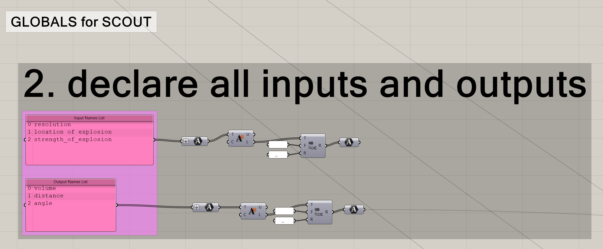

# Export Rhino to Scout

This is the workflow of running a example-arbitrary-computational-model in grasshopper and **simultaneously** exporting **inputs**, **outputs**, and **settings** to files Scout can read. These exported files will then be **uploaded** to Scout through our [uploader](https://scoutbeta.kpfui.dev/). 

Here is a [example](https://scoutbeta.kpfui.dev/?project=Dice) of the end result after following this tutorial. 

## Before you start

### Prerequisite

1. Rhino 6 with grasshopper installed 
2. [TRICERATOPS](https://www.food4rhino.com/app/triceratops) plug-in for grasshopper (by Amelia Harvey)
* (optional) Text editor (we recommend [VSCode](https://code.visualstudio.com/))

### Download Examples Files
TODO: these links don't work right now!!! 

#### files to work with
[Rhino]()

[Grasshopper]()

#### example exported files
[settings.json]()

[data.csv]()

[0_option.json]()

[0_volume.json]()

<!-- <a href="files/ScoutDemo_CompDesign.3dm" download>Rhino File</a> -->
::: tip
### Grasshopper Color Code
Different colors were used to denote different meanings in the grasshopper file. 

* *Pink* indicates input required from the user (thus needed to be changed)
* *White* are notes for you to read
* *Bright* green indicate "actions" required from the user, it might be a button to be clicked or a slider to be moved
* *Grey* and black are components that shouldn't be changed, the darker the color the less we recommend changing 
* *Dark green* means if you made a copy of a new group, you should connect the new group to the components circled in *dark green*
* *Purple* groups are previews in Rhino that you can turn on
:::

## Step 0. Open Files

Open Rhino and Grasshopper file and make sure no plug-in is missing.  
You should see something like this: 

## Step 1. Computational Model

Take a look at the Computational Model we generated and understand that: 

1. All the **inputs** for this model are **cross-referenced** so they can each be controlled by a slider.  
1. There are 2 types of **outputs** for each analysis:  
     1. A **numerical number** indicating the performance of this iteration as a whole  
     1. A **colored analysis grid**, the analysis grid requires:   
         * A list of exploded individual meshes  
         * A list of values that will be used to color the meshes  

## Step 2. Declare Input and Output Names

In the 2 *pink* text panels, type in the name of all of your inputs and outputs respectively.   

::: tip
* The names that are used here are only for your use to construct files and won't show-up in Scout so you can use shortened names  
* Make sure there are no empty lines
* Note the index of each of the input and output, those will be referenced later on in the file. 
:::

## Step 3. Set All Inputs
The input you set here will create all the possible combinations of all of your inputs.  
It will communicate the iteration information and the index for each input for that specific iteration to your `data.csv` and write the input part of the `settings.json` file. 
### Input Settings
Foreach Input: 
1. Set input Index *(upper left pink panel)* = the current input you want to set's **index** in the text panel you edited in Step 2 
1. The inputs that are used for your computational model *(lower left pink group)*
    * These can be **any type** that make up inputs for your computational model, the script will automatically convert them into indexes when generating the data.csv
    * These can be **ordered arbitrarily**, the order shows up here will be the order it will be displayed on the slider from left to right
1. The title of this slider in Scout *(upper right pink panel)*
1. The text tick marks of this slider in Scout *(lower right pink panel)*
    * The order of the tick will be displayed on the slider from left to right

::: warning
Make sure there are exactly a tick for each input increment
:::

Here we are showing 3 inputs for this computational model, if you were to make your own input, you will use the 4th one down on the bottom or copy that entire roll again as your new input. 

### Connect new Input
Follow the steps outlined above for your input settings, then we need to connect it to the rest of the grasshopper script: 
  Follow the bright green arrows in the image below 
  1. Connect your computational input to the lower left component
  1. Connect your `input settings` to the upper right `merge` component circled in *dark green*. 
  1. Connect your `series` component to the `cross reference` component
  1. Connect the `cross reference` component to your `list item` component's `list` field. 
  1. Connect the output of the second `list item` component to your computational model where it uses this input to do manipulations
  1. Connect the `index` of your input to the `merge` component on the lower right. make sure it is in the same order as your "input list" set in step 2. 

## Step 4. Set All Output
The output you set here will write the numerical result for each analysis to your `data.csv` file, create the output part of your `settings.csv` file, and will color and export your exploded analysis meshes as a `json` file into your `models` folder. 
::: warning
Check that your output meshes are off-setted from your model geometry to avoid overlaps. 
:::
### Output Settings
Foreach Output: 
1. You need from your computational model: 
      1. A **numerical value** for this iteration
      1. A list of exploded analysis **mesh**
      1. A list of **numbers** use to color the analysis mesh (same number of items as the exploded analysis mesh list)
1. Set output Index *(upper left pink panel)* = the current output you want to set's **index** in the text panel you edited in Step 2 
1. Set title (label) for this output *(top pink panel on the right)*
1. Set description for this output  *(2nd pink panel on the right)*
1. Set unit for this output's numerical value *(3rd pink panel on the right)*
1. Set min and max bound for this output  *(4th roll pink panels on the right)*
      * the white panel next to it is a hint for the bounds of the current iteration
1. Set color scale
1. Set tick mark text *(bottom pink panel on the right)*

Here we are showing 3 examples of outputs.   
To add another one you should use the 4th empty group or copy the entire group again on the bottom.  

### Connect new Output
To connect this to the rest of the grasshopper script, follow the bright green arrows: 
1. Connect 3 outputs from your computational model to the new group you copied on the very left. the 3 outputs: 
      1. A **numerical value** for this iteration
      1. A list of exploded analysis **mesh**
      1. A list of **numbers** use to color the analysis mesh (same number of items as the exploded analysis mesh list)
1. Connect your numerical output to the *dark green* `merge` on the top
1. Connect your `output settings` to the *dark green* `merge` on the bottom

## Step 5. Export Current Iteration Geometry
This will export your current iteration model into a white mesh and export as a `json` file in your `models` folder.  
Simply pass your current iteration geometry into this group here.  

## Step 6. Export Context
1. Separate all of your context geometry by color
1. Copy this group once for each color
1. Change the material setting for each of your color
1. Connect each of your colors with the group for exporting
1. Connect your `mesh` component to the `merge` component circled in *dark green* 

### Congrats! All the setting up is done, now we just need to compute all of your iterations! 

## Step 7. Animate all options
::: warning
First make sure to **save your GH and Rhino file** before you start simulating so you don't loose your progress if your computational model crashes. 

The great thing about this work flow is that even if your computational model crushed half-way, all the results for your past iterations would be saved already and you can pick up where you left off. 
:::

1. Set the `upper limit of slider` = `number of options -1`
1. Right click on your `slider` -> `Animate...`
1. Click `Browse...` -> set a location on your computer where you can save temp files. we will NOT be needing these. 
1. Set `Frame count` = `number of options -1`
1. Click `OK`

### Done! Now just wait for your computational model to finish. 
::: tip
You should see your files written out in real-time
::: details
* All the iteration files should be writing automatically to a folder called `scout_upload` in the same directory as your grasshopper file.  
* Go into `scout_upload` >> `models` folder, you should see all your iteration's geometry (`xxx_option.json`) and analysis meshes (`xxx_output_name.json`) be writing out here in real-time. 
* Go into `scout-upload` >> `.temp` you should see all your iterations' individual line of `data.csv` be writing out in real-time. 
:::

## Step 8. Write Final Files
Now you are done with all your simulations!  
Click this button to write out your `context.json`, `settings.json`, and `data.json`. 

::: tip
## Optional Step. Check your files before upload
We recommend opening up `data.csv` with a text/code editor (VS Code recommended) to check: 
1. No empty lines on the bottom roll (if you edited your `data.csv` and in excel, this is likely to happen)
1. All the iterations exists
1. All the columns match their header
1. No empty cells / short rolls
    * If you found any don't worry, re-run out those iterations and trouble shoot one by one. 
    * The analysis grid will automatically be written to the `models` folder and will overwrite your old file. 
    * Data for that iteration will also overwrite your old data in the `.temp` folder. 
    * When you are done simply repeat step 8 and it will recompile `data.csv` for you, bringing in the new data. 

You may also open up `settings.json` and/or other files with a text editor to check if everything exported correctly. There is un-likely to be an issue with these files if your `data.csv` had no issues. 

You are welcomed to edit your `settings.json` file with a text/code editor if you find it easier. 
:::

## Step 9. Up load to Scout
1. Open [Scout](https://scoutbeta.kpfui.dev/) in your browser

1. Open your local folder to `where your grasshopper file lives` >> `scout_upload`
1. You should see `settings.json`, `data.csv`, `context.json` in your directory. Drag EACH one of these to where it indicates on Scout. 

1. Open `models` >> `ctrl/command + A` select all >> Drag to `models` on Scout
1. Wait for everything to upload. 
1. Click `start scout`

### Congratulations! You are done! 
