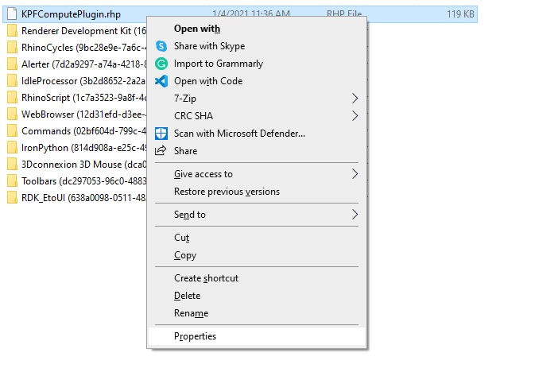
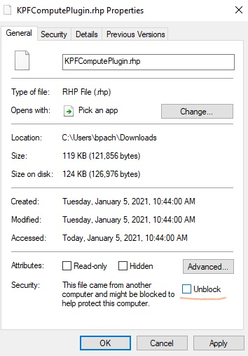
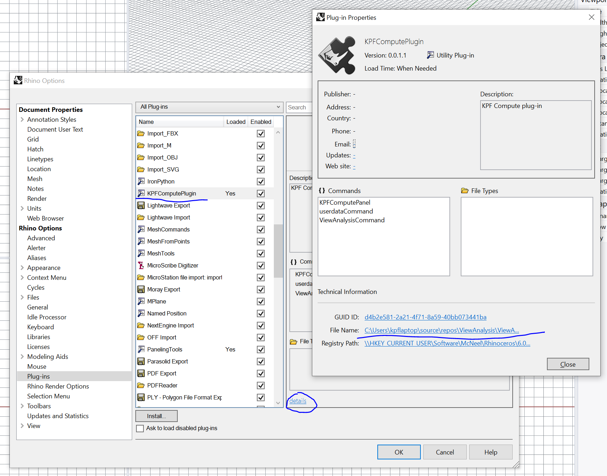
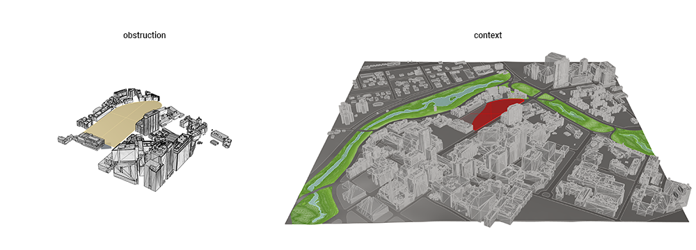
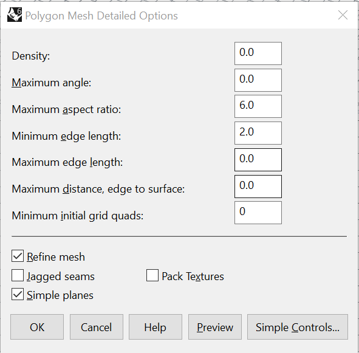
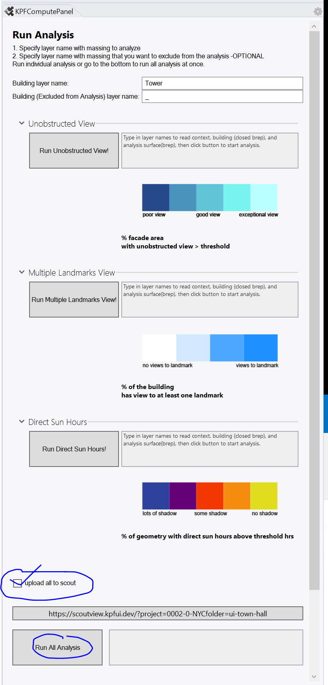
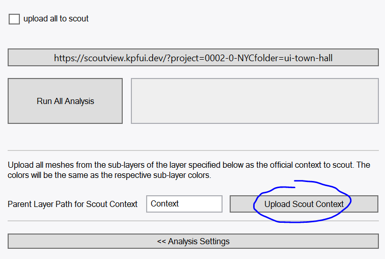
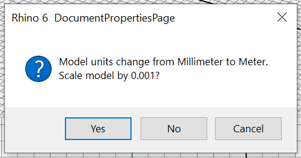

# KPF Compute Plugin

The KPF Compute plugin allows a user to run computational analysis on the cloud in Rhino 6.

## Installation

1. Download the plugin file: *KPFComputePlugin.rhp*. (the latest release is [v0.1.3](https://github.com/kpfdev/KPFComputePlugin/releases/tag/v0.1.3))
2. *Right click* on the the plugin and go to *Properties* and check *Unblock*. This ensures the plugin will be accepted by your computer.

3. Close the *Properties* window, and drag the plugin into Rhino. Double check the plugin is loaded by typing *PluginManager* in the Rhino Command prompt. Scroll or search for **KPFComputePlugin** and make sure it is *enabled*.
4. Type *KPFComputePanel* in the Rhino Command prompt, the panel should appear.

:::tip
The default plugin location for Rhino plugins is `C:\Users\<user-name>\AppData\Roaming\McNeel\Rhinoceros\6.0\Plug-ins`  
However, rhino will not be moving this .rhp file into there automatically. If you would like all your plug-ins in one place, move your plug-in file into this folder first before proceeding to stop 3.  
There is also nothing wrong with keeping your plug-in file in the Downloads folder. It will be perfectly happy there.  
:::

## Update

1. Locate the old *KPFComputePlugin.rhp* file. You can find it's location by using the *PluginManager* command in Rhino. Scroll or search for **KPFComputePlugin** and click *details* and click on the the *File Name*. This will take you directly to the folder where your *KPFComputePlugin.rhp* file lives. 

2. Close Rhino. Delete the old copy of *KPFComputePlugin.rhp*. 
3. Now you can follow the install instructions above OR Download the new *KPFComputePlugin.rhp* at the same location as the old one. *Right click* on the the plugin and go to *Properties* and check *Unblock*. Now you should be good to go (open rhino and type in **KPFComputePlugin** to see if the plug-in opens). 

## Running Analysis

The Plugin pulls geometry data from user-specified layers for analysis. The names of the layers can be named anything, but must match what is entered into the *Analysis Settings* page.

### Opening up the plugin 

Type `KPFComputePanel` in the Rhino Command prompt to open the panel. You can grab the panel and snap it to either the left or right side of the Rhino interface.

The plugin contains three pages:  

- *Select Analysis*
- *Analysis Settings*
- *Run Analysis*

### Prepping the Rhino File

#### 1. Obstructions

**Obstructions** are different from Context in that Obstructions are the context geometry that will cause **meaningful obstructions of sunlight or views** to the project site. Only include geometry that are NECCESSARY to your analysis.  
**Context** is any geometry that is static in the scene for **visualization** purposes, such as adjacent buildings, trees, road geometry, curbs, water, or ground plane.  

Although both polysurfaces(breo) geometry and mesh geometry are accepted. We STRONGLY Recommend using a very simple meshes.  

:::warning
The larger the context model - the longer the analysis will take to process.
Meshes are always smaller than polysurfaces or breps. 
:::

#### 2. Building Geometry

Building geometry is the geometry you want to analyze. The building geometry can be single or multiple buildings.

:::tip
make sure the building geometry are all **Closed BREPS!**
refer to next section for more instructions on Modeling Guideline for Building
:::

#### Modeling Guideline for Building Geometry: 
Building geometries are **required** to be Close Poly-surfaces! or as grasshopper likes calling it: close breps. 
Building geometries also **need to pass** `BooleanUnion` command in rhino with no errors. 
Curved surfaces are strongly **not recommended**. 
Buildings cut into individual floors often fails `BooleanUnion`. They usually needs to be rebuilt with a bit of work. We provided some tips below: 

::: tip
good ways to rebuild geometry: 
- Use command `DupFaceBorder` to get the top or bottom face border of your geometry, then re-extrude
- when massing is cut into different floors, BooleanUnion often fails. Delete every floor but leave only one, and `Scale1D` of that geometry. 
- sometimes the top/bottom face might not be perfect parallel to the C-plane. use `DupFaceBorder` and then `ProjectToCPlane` then re-extrude your geometry
- Rebuild your curves with straight line segments using `Rebuild` command in rhino and use a `Degree` of `1`
- After using `DupFaceBorder`, use `CurveBoolean` to join regions of the curve that touches before re-extruding, sometimes `CurveBoolean` is more reliable than `BooleanUnion`. This also will catch small inaccuracies in modeling that might cause boolean union to fail. 
:::

#### How to Name Rhino Layers

This plugin uses *full paths* to reference layers.  

The full-path of a layer is all it's parent layer names concatenated with `::` to its own name.

For example, the layer "Context Geometry" is the child of layer "3DSite", then the full path of layer "Context Geometry" is "3DSite::Context Geometry".

#### 3. Analysis Surface(s)

Put Analysis surfaces into its own layer (if you have any), use the command `dir` in the Rhino command prompt to check if the normals are facing the correct direction.

### Running Single Analysis

#### 1. Analysis Selection

Select the analysis you want to run from the *Select Analysis* page by clicking the given checkboxes. Then clicking on the button *Go to Analysis Settings >>>*

#### 2. Analysis Settings

**Double check the following:**

- Context layer name matches your context layer full path* 

- Analysis tile size are reasonable, the smaller they are, the slower the analysis but more accurate the results.

- Choose climate (if applicable)

- Choose your analysis surface layers and your target surface layers (if applicable)

Click on button *Run Analysis >>>* to go to next page.

#### 3. Run Analysis

Type the layer name for the building geometry you want to read from, and additional building geometry if applicable (this second field will be included in the geometry but will not be used to construct analysis points). If you do not have a podium layer or additional buildings to add, leave the field with the default value `_`.

Click on Run xxx Analysis to run the given analysis.

:::tip
Be patient and drink some ☕ while the analysis processes. Once the analysis is done, a analysis mesh should be returned as a sublayer in your building layer along with a numerical value in the *Run Analysis* page.
:::

### Running Multiple Analysis

#### 1. Analysis Selection

Select the analysis you want to run from the "Select Analysis" page by clicking on the given checkboxes. 

#### 2. Analysis Settings

Each analysis has its own settings, i.e. Harmful/Useful radiation requires a climate to be selected and Sky Exposure requires a ground surface plane to be selected.

#### 3. Run Analysis

Click on button *Run All Analysis* to let the plug-in run all the analysis you have selected 

To look at each individual analysis result, go back to your rhino layers and turn on/off the analysis. A analysis summary is also shown as text in one of the child layers in the building geometry layer.

### Upload to Scout

The plugin can be used to iteratively run analysis, but can also be used to upload the analysis, geometry, and context data to an interactive web interface named [Scout](https://scout.build/).

Click on button *Select/Create Scout Design Space*, this will bring up a web form to select or create a project in Scout. If you are creating a new project, you must give it a name and select the analysis that this design space will include. If you are selecting an already existing design space, it will dictate what analysis will be available. Once you are done selecting, go back to rhino and the plug-in should have already brought you to the *Analysis Settings* page.

:::warning
Once you create a project with the given analysis, you cannot go back. However, you can always create another project with different analysis.
:::

#### Run either Single Analysis or Multiple

check the checkbox for *upload to scout* and click on the button *Run All Analysis*. This will run all the analysis for you and upload the results automatically to Scout. (note that it will only upload to scout when clicking Run All Analysis and thus will not upload individual analysis)

If this is the first time you are uploading to scout in this rhino session, the scout web-page will open automatically once the upload is complete. If it is not the first time, a dialog box will show-up prompting you to re-fresh the already open scout web-page.  

To upload more models, simply make-sure the name of the building layer is unique to this design space. It will add more models to your design space. If you want to replace / update an older design, just upload a new model with the same name. 

#### Upload Context To Scout

After uploading your first model, your scout space will be populated with the Obstruction mesh as its context. If you would like to have a more complex context for visualization, you can upload those through a different button. 

Scroll to the bottom of the "Run Analysis" Panel and you should see the section shown in image below. 

Mesh all of your context geometry and put different colored meshes on different layers. Color each layer with your desired color, and now put all these layers with geometry *under* a parent layer. Type in the *parent layer name* in the text box and click *Upload Context To Scout* button. This will pull all the meshes from the sub-layers of the *parent layer* and color them with their layer color and upload to scout. 

Refresh scout and you should see your updated context. (note that meshes that are invisible from behind, if you have missing mesh faces, just flip them in Rhino and re-upload)

You can re-upload until you are happy with it and it will just re-write the previous uploaded context. 

## Available Analysis

- [Direct Sunlight Hours](https://rhino.kpfui.dev/api/definition/Daylight_DirectSun_RH.gh)
- [Harmful/Useful Radiation](http://kpfintranet/DAM/#!/?page=~2F~2Fkpfintranet~2FDAM~2F_content~2F_data~2FTools~2FSolar_Analysis~2FUseful_vs_Harmful_Radiation_Map~2Freadme.md&technical=true&developer=false&private=false)
- [Multiple Landmarks View](http://kpfintranet/DAM/#!/?page=~2F~2Fkpfintranet~2FDAM~2F_content~2F_data~2FTools~2FView_Analysis~2FMultiple_Landmarks_View~2Freadme.md&technical=true&developer=false&private=false)
- [Sky Exposure](http://kpfintranet/DAM/#!/?page=~2F~2Fkpfintranet~2FDAM~2F_content~2F_data~2FTools~2FDaylight~2FSky_Exposure~2Freadme.md&technical=true&developer=false&private=false)
- [Unobstructed View](http://kpfintranet/DAM/#!/?page=~2F~2Fkpfintranet~2FDAM~2F_content~2F_data~2FTools~2FView_Analysis~2FUnobstructed_View~2Freadme.md&technical=true&developer=false&private=false)

## Common Issues

### Checking Surface Normals

If meshes seem incorrect in Scout, check the surface normals of the context geometry by using the command `dir`. All normals should be facing outwards. 

::: tip
Change the color of *Backface visibility* by going to file > properties > View > shaded. Change the *Backface Settings* color to visualize which faces are facing the wrong way. All faces should be facing outward from the buildings. 
:::

### Analysis mesh returns but with no result: Checking Model Scale

Use the `Distance` command in Rhino to make sure your model is the right size. 
If your model unit is off, the analysis will be running on a completely incorrect scale. 

To prevent this error: 
make sure to click "Yes" and re-size your model when converting your model unit to Feet or Meters

### Analysis mesh returns but colors are messed up

This might be caused by having curved geometry as input building breps. The root cause of this is still unknown and we are investigating. 

::: tip
Use command `DupFaceBorder` to get the top or bottom face border of your curved geometry, then
Rebuild your curves with straight line segments using `Rebuild` command in rhino and use a `Degree` of `1`
Re-Extrude your poly-line
:::

### Team Test

1. Install KPFComputePlugin [instructions](https://kpfdev.github.io/scout-docs/documentation/KPF-compute-plugin.html#installation)
2. open *190924_One Vanderbilt Anlaysis Model.3dm*
3. type *KPFComputePlugin* to open panel - you can snap the panel to any side of the Rhino Interface.
4. The version of the panel should be `V 0.1.3(loadbalancer test)`
5. Click on *I'm using Scout!*
6. type in *0002-0-NYC* - should show up in the autocomplete
7. click on the blue button *Select from existing projects* and select *ui-team-lb-test*
8. click on green button *use existing project*
9. Go back to Rhino
10. leave all analysis settings as default
11. click on *run analysis*
12. hide the *Tower* layer
13. design your own building on the site
14. check *upload all to scout*
15. Run each analysis for your building independently or click on *Run All Analysis* to run them all and upload directly to Scout

:::tip
Your design will only upload to Scout when you click on *Run All Analysis*. Which allows you to iterate on your design scheme without uploading to the team Scout.
:::