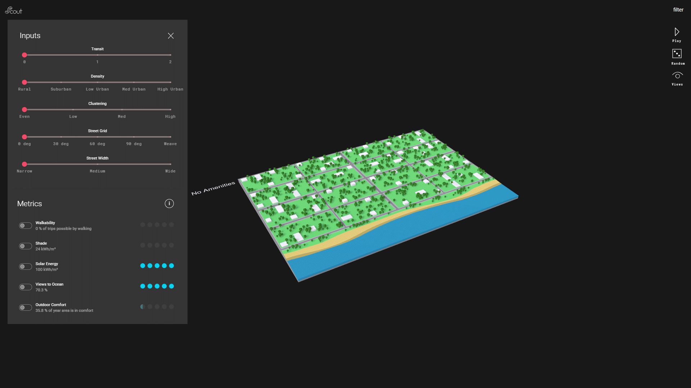

# Introduction

Scout is a shared web platform that helps our global firm gain quick data-driven insights, present to clients, and engage with the community. Through Scout, designers and collaborators can easily explore and compare thousands of options, make more informed decisions, and enjoy the creative freedom of visualizing results in real time. By automating certain components of design, Scout frees focus for deeper development, innovation, and craft. It is software independent, easily accessible, and packages complex design scenarios into one click. Whether for two minutes or two hours, different types of users can coexist and get quick takeaways or obtain deep insights.

Scout is developed by <a href="https://ui.kpf.com" target="_blank">KPF Urban Interface</a>, a research and design wing within <a href="https://kpf.com" target="_blank">Kohn Pedersen Fox Architects</a>, that engages with the contemporary issues that impact the future of our buildings and cities. KPFui uses spatial and temporal urban data analytics for informed decision making in the design of buildings and cities for people while engaging with some of the most critical contemporary urban topics: livability, sustainability, and mobility.

We believe that smart cities & buildings are not about drones, sensors or autonomous vehicles. A truly smart city should leverage data to design better neighborhoods and utilize technology to make that data transparent and publicly accessible. We think people should be in control of technology and not the other way around.

Built with :heart: and 

