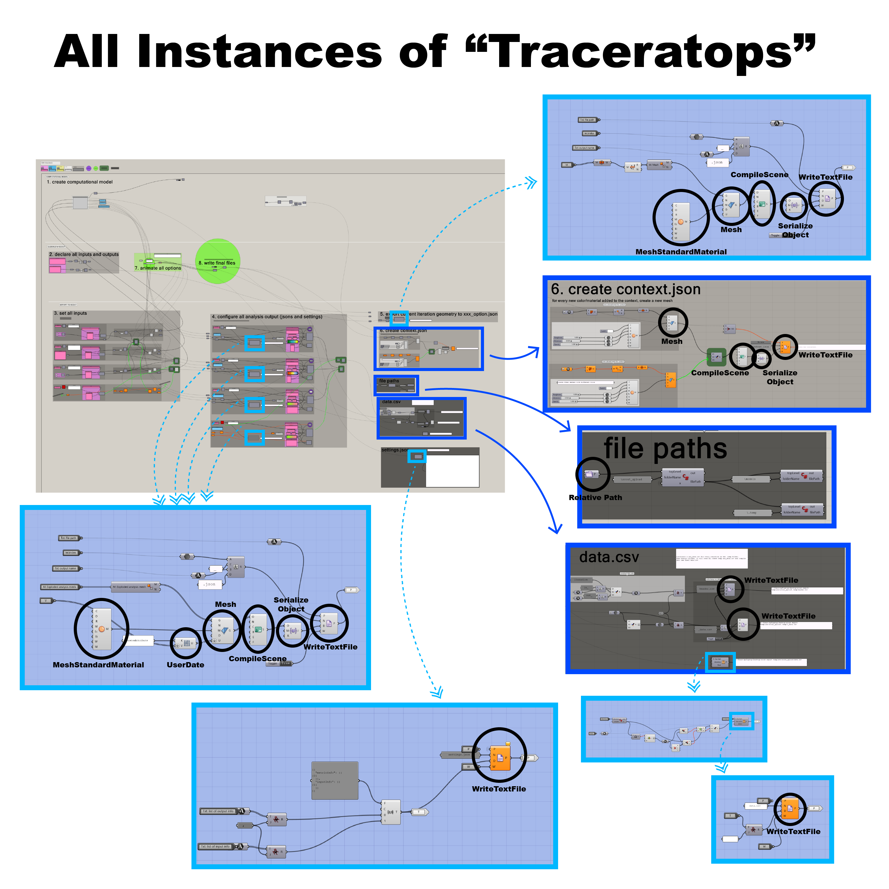

# Export Rhino to Scout TroubleShoot

::: tip

## Check list

### Before Opening Gh File:
- update rhino to latest version
- update triceratops to latest version
- check if computational model has all CLOSED Brep geometry

### Before Working on File:
- check all triceratops components are present
- check if folders scout upload and scout upload / .temp and scout upload / models folders were created

### Before each Run of entire simulation space:
- clear scout upload / .temp  and scout upload / models folders of old file
- check changing the iteration slider changes computational model geometry (if not, the inputs are not hooked up corrected with computational model).
- check if any output number is > 1,000,000. if it is, divide by 1,000,000 before exporting the number (gh will write them in scientific notation and that will not be read by scout as a number)
- check if all materials’ opacity are NOT 0

:::

## Steps for trouble shooting 
### 1. First check if all the files exists: 
- scout upload (folder)
    - `settings.json`
    - `data.csv`
    - `context.json`
    - models (folder)
        - `xxx_option.json`
        - `xxx_your_output.json`
        - ... (for all iterations)
    - .temp (folder)
        - `xxx_data.csv`
        - ... (for all iterations)

### 2. Check your `data.csv` file
Open in excel and check
Does it: 
- have `iteration, in_your_input, ... , out_your_output, ...` as its header?
- does that header include all of your inputs and outputs?
- data inside match your header? missing data? extra data?
- everything (besides the headers) are all numbers (no scientific notation!)
- headers all lower case

Then, open with text editor (VSCode) and check
- no empty line on the bottom of file (excel would save a empty role at the end)
- no comma at end of each line 

### 3. Check your `settings.json` file
- if all of your inputs and outputs exists?
- inputs should be named "in_your_input"
- outputs should be named "your_output" without the "out_" keyword in front
- all lower case names
- does your inputs and output names match EXACTLy those in your `data.csv` header and in your models folder? 

See the next section *Data Structures* for more information

## Fix Missing TRICERATOPS Components
The diagram below notes all the triceratops components that were used in the example file, including those that were inside clusters. 
If the version of grasshopper was behind that of TRICERATOPS it will not load correctly even after updating grasshopper to the correct version. 
Here denotes the correct correction
- light blue box means opening up a cluster
    - you can open up a cluster by double clicking on the "taped up box" icon in the center of it
    - you can leave a cluster by going to the upper left corner of your canvas and click on the "opened box" and choose "save and close" 
- dark blue box means zooming in

## Common Issues
### missing objects / geometry faces in scout
Most likely caused by a "flipped" mesh in scout since meshes are only visible on ONE side in scout. If your geometry in grasshopper is not a CLOSED brep, it will likely be converted incorrectly to a mesh and thus some faces might be flipped unexpectedly. 
Another cause might be the geometry's material's opacity is set to 0. 

### model not changing with slider / all outputs look the same
Did you REPLACE all of your computational model's input with data from scout's input group? 

