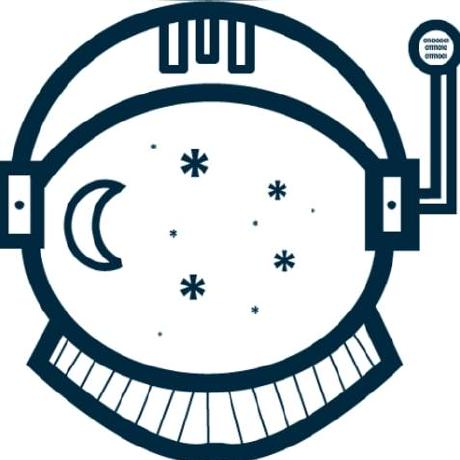

## Introduction

Scout is an advanced computational web visualization analytics platform to explore iterative design spaces. Where a visitor can simulate 1000(s) of different design along with performance analysis to understand trade-off decisions and gain insight into the design process.

[scout](https://scout.build)

## Contributors

## Tip of the Hat

This work would not be possible without the amazing work accomplished by these teams.

[D3.js](https://github.com/d3/d3)

[Three.js](https://github.com/mrdoob/three.js/)

[Vue.js](https://github.com/vuejs/vue)

## Issues

Want to help improve Scout platform or documentation?

File an issue on [Github](https://github.com/kpfdev/scout-docs)
